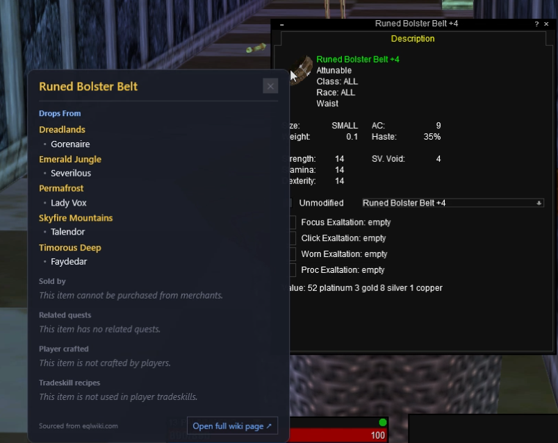

# eql-tooltip

A lightweight overlay for **EverQuest Legends** that shows an item's wiki info — where it drops,
who sells it, quests, tradeskills — right next to your cursor while you play. Hover an item, hold a
hotkey, and a panel pops up sourced live from [eqlwiki.com](https://eqlwiki.com). No more alt-tabbing
to look things up.

It is an **external, passive** tool. It does not inject into, hook, or read the game's memory. It
only reads the screen (OCR) when you hold the hotkey, and looks the name up on the public wiki.



## Install & run

1. Go to the [**Releases**](../../releases) page and download `EqWikiOverlay.exe` from the latest release.
2. Double-click it. It runs in your system tray (gold **EQ** icon). Nothing to install — the .NET
   runtime is bundled inside the exe.
   - The first launch may show a blue "Windows protected your PC" box (the exe isn't code-signed).
     Click **More info → Run anyway**.
3. In EQ, set your video mode to **Windowed** or **Borderless Window** (an overlay can't draw over
   exclusive fullscreen).

## Use it

1. Point at an item so its name is on screen — either **hover** it in your inventory (EQ shows a
   tooltip) or **open its Description window** (e.g. from a link someone posted).
2. **Hold the hotkey** (default **Shift+A**). The wiki panel appears pinned to the left of your
   cursor.
3. Release the hotkey to hide it (or click the **✕**).

The panel shows the acquisition info you *can't* see in-game — **Drops From** (grouped by zone and
mob), **Sold by**, **Related quests**, **Player crafted**, **Tradeskill recipes** — and a button to
open the full wiki page. In-game stats are intentionally omitted since EQ already shows those.

## Tray menu

| Item | What it does |
|------|--------------|
| **Look up item under cursor** | Same as holding the hotkey. |
| **Set hotkey…** | Press any combo (Shift/Ctrl/Alt + a key) to rebind. Applies instantly. |
| **Test lookup by name…** | Type an item name to look it up — no game needed. |
| **Show OCR debug window** | Live view of the last capture, OCR text, and what was picked. |
| **Clear wiki cache** | Wipe cached results and re-fetch. |
| **Open settings folder** | Opens `%AppData%\EqWikiOverlay`. |
| **Exit** | Quit. |

## Settings

Stored at `%AppData%\EqWikiOverlay\settings.json`. Most are editable from the tray, but you can tweak
the OCR capture box here if names get cut off or misread:

| Field | Meaning |
|-------|---------|
| `Hotkey` | Hold-to-show combo, e.g. `Shift+A`, `Ctrl+Shift+I`. |
| `TooltipWidth` / `TooltipHeight` / `TooltipOffsetX` / `TooltipOffsetY` | The tight capture box for the inventory tooltip (below-right of the cursor). |
| `CaptureLeft` / `CaptureRight` / `CaptureUp` / `CaptureDown` | The wide capture box used for an item Description window (name in the title above the cursor). Widen a side if a name is missed. |
| `WikiApiUrl` | MediaWiki API base. Default `https://eqlwiki.com/api.php`. |

## How it works

```
hold hotkey → capture the tooltip region by the cursor → Windows OCR reads the item name
   → fuzzy-match it against the eqlwiki search → fetch the page → show the acquisition sections
```

OCR misreads (EQ's small font) are recovered by fuzzy-matching the OCR text against the wiki's
search results, so a slightly garbled name still lands on the right page.

## Build from source

Requires the [.NET 10 SDK](https://dotnet.microsoft.com/download).

```sh
dotnet test                                   # run the test suite
dotnet run --project EqWikiOverlay            # run locally
```

Produce the self-contained single-file exe that ships in a Release:

```sh
dotnet publish EqWikiOverlay/EqWikiOverlay.csproj -c Release -r win-x64 \
  --self-contained true -p:PublishSingleFile=true -o publish
```

The exe lands at `publish/EqWikiOverlay.exe`.

## Project layout

- `EqWikiOverlay/Core/` — screen capture, OCR, tooltip reading, hotkey hook, orchestration.
- `EqWikiOverlay/Wiki/` — eqlwiki MediaWiki client, section parsing, SQLite cache.
- `EqWikiOverlay/Ui/` — the overlay/popup/side-panel windows and tray icon.
- `EqWikiOverlay.Tests/` — unit tests plus a couple of live-wiki integration tests.

## Credits

Item data comes from the community [EverQuest Legends Wiki](https://eqlwiki.com). This tool just
displays it — please support and contribute to the wiki.

Not affiliated with Daybreak Game Company or the EverQuest Legends team.
